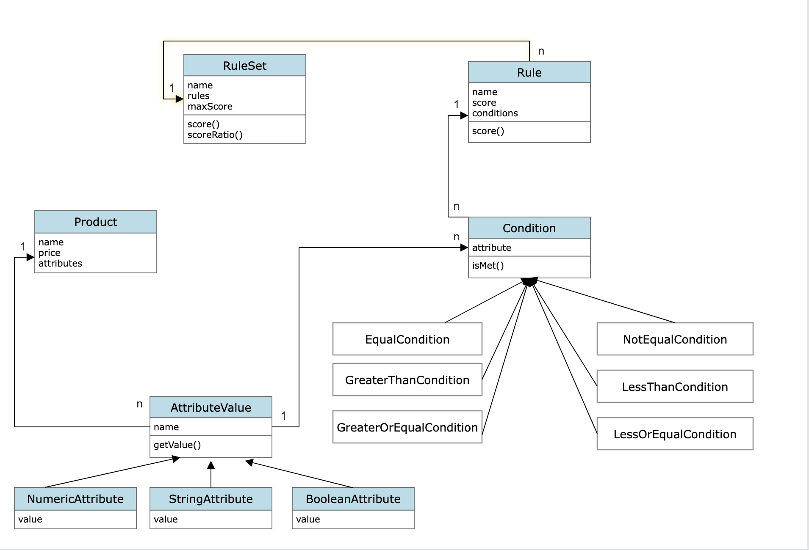

# Context Lab Design & Coding Assignment by Ron Marom

### UML diagram

For UML diagram, see https://github.com/ronmarom78/RonMaromContextLabsAssignment/blob/main/ContextLabAssignment/uml/uml.png

### Assumptions
1. Every rule in the rule set is composed of only ***&&*** of simple conditions (i.e. not ***||***), even adding ***||*** conditions, perhaps with parentheses, would require recursive membership between rules.
2. Every product has a numeric attribute called ***price***
3. The input is legal, in the sense that every product contains the attribute names mentioned in the rules. If a product doesn't have the attribute, it is assumed that it does not meet the said condition.
4. Attribute names and string values are case sensitive.

### Execution
1. Clone this repository.
2. Install a JRE and include it in the shell's `PATH` variable (I tested with J2SE-17)
3. The main class to run is `marom.ron.contextlabs.Main`
